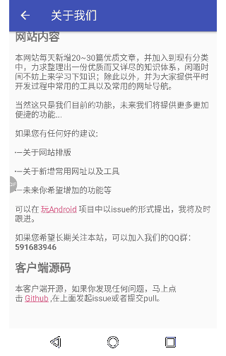

### Android 超链接点击跳转 
先看效果图  

    

一开始我想到的解决方案就是给 TextView 添加 android:autoLink="web" 属性。但是由于我要显示的文本内容比较复杂，仅仅添加 autoLink 属性并不能达到想要的效果。  
在查找一番资料之后，还是达到了想要的效果。这里将这一部分的知识点记录下来，以便日后查找。
## autoLink  
TextView 除了可以匹配网页之外，还可以匹配电话、邮箱、地图。只需要将 autoLink 设置为对应的值即可。  
autoLink：  
1、none：默认值，不匹配任何值。
2、Web：匹配网址。  
3、Email：匹配邮箱地址。  
4、Phone：匹配电话号码。  
5、Map：匹配地图地址。  
6、All：匹配所有（下图设置的就是all）。
  

可以看到，设置 autoLink 属性虽然能实现跳转，但是这种方式显示的文本内容太过简单，如果显示的文本内容带有格式，就没办法很好的完成任务了。  
如果想要达到文章开头动图中的效果，就要用 Html 来实现了。  
## Html  
做 Android 的都知道，TextView 是可以显示 html 格式文本的。TextView 想要显示 html 富文本就要用到 Html.fromHtml(String str) 了。  
这一部分直接上代码(布局文件只是一个 TextView ，这里就不贴出来了)
```
aboutContentTV = findViewById(R.id.about_content);
String aboutContent = "<h2>网站内容</h2>" +
        "<p>本网站每天新增20~30篇优质文章，并加入到现有分类中，力求整理出一份优质而又详尽的知识体系，闲暇时间不妨上来学习下知识；除此以外，并为大家提供平时开发过程中常用的工具以及常用的网址导航。</p>" +
        "<p>当然这只是我们目前的功能，未来我们将提供更多更加便捷的功能...</p>" +
        "<p>如果您有任何好的建议:</p>" +
        "<ul>" +
        "<li>—关于网站排版</li>" +
        "<li>—关于新增常用网址以及工具</li>" +
        "<li>—未来你希望增加的功能等</li>" +
        "</ul>" +
        "<p>可以在&nbsp;<a href=\"https://github.com/hongyangAndroid/wanandroid\" target=\"_blank\">玩Android</a>&nbsp;项目中以issue的形式提出，我将及时跟进。</p>" +
        "<p>如果您希望长期关注本站，可以加入我们的QQ群：<b>591683946</b></p>" +
        "<h2>客户端源码</h2>" +
        "<p>本客户端开源，如果你发现任何问题，马上点击&nbsp;<a href=\"https://github.com/ljiezhou/WanAndroid\" target=\"_blank\">Github</a>&nbsp;,在上面发起issue或者提交pull request。</p>";
//设置超链接可点击
aboutContentTV.setMovementMethod(LinkMovementMethod.getInstance());
aboutContentTV.setText(Html.fromHtml(aboutContent));
```