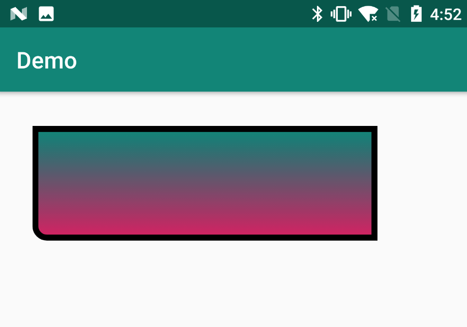

先说说为什么要用shape吧。  
在实际开发中，UI设计人员会给一些png图作为View背景。如果直接拿来用的话，是很方便的。但是后续想要优化，比如apk瘦身、较少内存，那么就需要用到shape了。  
<span id="shape">shape标签定义的Drawable对应的类型是GradientDrawable。 </span>
好处：  
- 很方便得到一个矩形，圆，椭圆，圆环，很容易维护和修改
- 很方便实现圆角，渐变
- 代替图片作为View的背景，减少apk的体积
- 大图片耗内存，，使用Drawable节省内存，Android本身对Drawable做了很好的优化  

那么什么时候选择使用Drawable呢
- 理论上能用Drawable的地方就用Drawable
- 如果通过shape标签就能定义的几何图形，就不要用图片
- 渐变类型的背景也尽量使用shape实现
- 不规则，复杂的图形还是只能使用图片
- 有些特殊拉升效果需要使用.9.png图片  
[以上内容来自这里](https://www.cnblogs.com/popfisher/p/6238119.html)

那么当shape文件太多了，哪怕只要改一个颜色都要新建一个shape文件时改怎么处理呢？  
答案是自定义控件。[想看原作者的可以点这里](https://www.jianshu.com/p/4b20502f2692)  
一开始我也没思路，在网上查找资料后逐渐理清了思路。其实说白了就是一个自定义控件。  
首先，前面已经说了shape能干写什么。[能干些什么](#shape)  
这里以矩形为例（其他形状原理类似，只要掌握原理即可）  
shape的基本属性（这里只选择四个常用的属性进行说明）：  
- corners 圆角
- gradient 渐变
- solid 填充
- stroke 描边
这几个属性的使用方式这里不做说明，我们只需要知道可以通过这几个标签设置圆角、背景（渐变、填充）、描边即可。  
如果每个背景都要新建一个xml文件，那么当xml文件过多之后，维护就是个问题了。所以能不能将这些属性封装起来用自定义控件的方式来使用呢？当然可以，前面已经说来用自定义控件的方式来解决shape文件太多的问题。  
思路：
在自定义控件中新建一个shape对应对类，然后再对shape中对每个属性进行设置即可。
shape的使用场景中多是在TextView或者Button中设置背景。所以这里就用Button来做演示。  
在写代码之前我需要知道，shape标签对应的是GradientDrawable类。只有拿到这个类我才可以对shape进行渲染。  
先看效果

```
//这篇文章的主题是shape，所以矩形用这种方式创建
<com.zhou.demo.CommonShapeButton
        android:layout_width="300dp"
        android:layout_height="100dp"
        android:layout_margin="30dp"/>
```

```
public class CommonShapeButton extends AppCompatButton {
    private static final int TOP_LEFT = 1;
    private static final int TOP_RIGHT = 2;
    private static final int BOTTOM_RIGHT = 4;
    private static final int BOTTOM_LEFT = 8;

    // 默认阴影值
    private float DEFAULT_ELEVATION = 4f;
    /**
     * 描边颜色
     */
    private int mStrokeColor = 0;

    /**
     * 圆角半径
     */
    private int mCornerRadius = 0;
    /**
     * 圆角位置
     * topLeft、topRight、bottomRight、bottomLeft
     */
    private int mCornerPosition = -1;

    /**
     * 阴影效果
     */
    private boolean mWithElevation = false;

    /**
     * shape模式
     * 矩形（rectangle）、椭圆形(oval)、线形(line)、环形(ring)
     */
    private int mShapeMode = 0;
    /**
     * 填充色
     */
    private int mFillColor;

    //设置了起始颜色和结束颜色，表示渐变
    /**
     * 起始颜色
     */
    private int mStartColor = 0;

    /**
     * 结束颜色
     */
    private int mEndColor = 0;

    /**
     * 渐变方向
     * 0-GradientDrawable.Orientation.TOP_BOTTOM
     * 1-GradientDrawable.Orientation.LEFT_RIGHT
     */
    private int mOrientation = 0;


    /**
     * 描边宽度
     */
    private int mStrokeWidth = 0;
    private GradientDrawable mGradientDrawable = new GradientDrawable();

    public CommonShapeButton(Context context) {
        super(context);
    }

    public CommonShapeButton(Context context, AttributeSet attrs) {
        super(context,attrs);
        init(context, attrs);
    }

    public CommonShapeButton(Context context, AttributeSet attrs, int defStyleAttr) {
        super(context, attrs, defStyleAttr);
        init(context, attrs);
    }

    private void init(Context context, AttributeSet attrs) {
        TypedArray typedArray = context.obtainStyledAttributes(attrs, R.styleable.CommonShapeButton);
        mShapeMode = typedArray.getInt(R.styleable.CommonShapeButton_csb_shapeMode, 0);
        mFillColor = typedArray.getColor(R.styleable.CommonShapeButton_csb_fillColor, 0xFFFFFFFF);
        mStrokeColor = typedArray.getColor(R.styleable.CommonShapeButton_csb_strokeColor, 0);
        mStrokeWidth = typedArray.getDimensionPixelSize(R.styleable.CommonShapeButton_csb_strokeWidth, 0);
        mCornerRadius = typedArray.getDimensionPixelSize(R.styleable.CommonShapeButton_csb_cornerRadius, 0);
        mCornerPosition = typedArray.getInt(R.styleable.CommonShapeButton_csb_cornerPosition,-1);
        mStartColor = typedArray.getColor(R.styleable.CommonShapeButton_csb_startColor, 0xFFFFFFFF);
        mEndColor = typedArray.getColor(R.styleable.CommonShapeButton_csb_endColor, 0xFFFFFFFF);
        mOrientation = typedArray.getColor(R.styleable.CommonShapeButton_csb_orientation, 0);
        typedArray.recycle();
    }

    static {

    }

    @RequiresApi(api = Build.VERSION_CODES.JELLY_BEAN)
    @Override
    protected void onMeasure(int widthMeasureSpec, int heightMeasureSpec) {
        super.onMeasure(widthMeasureSpec, heightMeasureSpec);
        //在onMeasure中做这些工作对原因
        //原作者对解释是根据view的绘制流程在准备渲染的时候做一些事情会更优雅一点
        if (mStartColor != 0xFFFFFFFF && mEndColor != 0xFFFFFFFF) {//渐变色
            mGradientDrawable.setColors(new int[]{mStartColor, mEndColor});
            if (mOrientation == 0) {
                mGradientDrawable.setOrientation(GradientDrawable.Orientation.TOP_BOTTOM);
            } else if (mOrientation == 1) {
                mGradientDrawable.setOrientation(GradientDrawable.Orientation.LEFT_RIGHT);

            }
        } else {//填充色
            mGradientDrawable.setColor(mFillColor);
        }

        if(mStrokeWidth != 0xFFFFFFFF){
            mGradientDrawable.setStroke(mStrokeWidth,mStrokeColor);
        }

        //填充模式
        if (mShapeMode == 0) {
            mGradientDrawable.setShape(GradientDrawable.RECTANGLE);
        } else if (mShapeMode == 1) {
            mGradientDrawable.setShape(GradientDrawable.OVAL);
        } else if (mShapeMode == 2) {
            mGradientDrawable.setShape(GradientDrawable.LINE);
        } else if (mShapeMode == 3) {
            mGradientDrawable.setShape(GradientDrawable.RING);
        }
        // 统一设置圆角半径
        if (mCornerPosition == -1) {
            mGradientDrawable.setCornerRadius(TypedValue.applyDimension(TypedValue.COMPLEX_UNIT_PX, mCornerRadius, getResources().getDisplayMetrics()));
        } else {// 根据圆角位置设置圆角半径
            mGradientDrawable.setCornerRadii(getCornerRadiusByPosition());
        }

        setBackground(mGradientDrawable);

        // 5.0以上设置阴影
        if (mWithElevation && Build.VERSION.SDK_INT >= Build.VERSION_CODES.LOLLIPOP) {
            setElevation(DEFAULT_ELEVATION);
        }
    }

    /**
     * 根据圆角位置获取圆角半径
     */
    private float[] getCornerRadiusByPosition() {
        float[] result = new float[]{0f, 0f, 0f, 0f, 0f, 0f, 0f, 0f};
        if (containsFlag(mCornerPosition, TOP_LEFT)) {
            result[0] = mCornerRadius;
            result[1] = mCornerRadius;
        }
        if (containsFlag(mCornerPosition, TOP_RIGHT)) {
            result[2] = mCornerRadius;
            result[3] = mCornerRadius;
        }
        if (containsFlag(mCornerPosition, BOTTOM_RIGHT)) {
            result[4] = mCornerRadius;
            result[5] = mCornerRadius;
        }
        if (containsFlag(mCornerPosition, BOTTOM_LEFT)) {
            result[6] = mCornerRadius;
            result[7] = mCornerRadius;
        }
        return result;
    }
    /**
     * 是否包含对应flag
     * 按位或
     */
    private boolean containsFlag(int flagSet, int flag) {
        return (flagSet | flag) == flagSet;
    }
}

```
